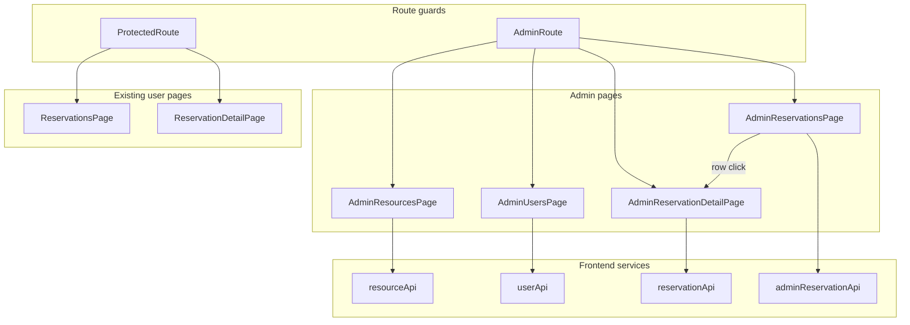

# Admin Features Plan

## Context

Most admin **backend** APIs already exist:

| Area | Backend status | Frontend status |
|------|----------------|-----------------|
| Resources | `POST/PATCH/DELETE /api/resources` (admin); public `GET` | Browse only at `/resources` |
| Users | Full admin router at `/api/users` (list, get, PATCH role/isActive, DELETE deactivate) | None |
| Reservations | Admin can `GET/PATCH/DELETE /:id` any reservation; **list is own-only** | "My Reservations" at `/reservations` |

Recent fix: [`reservation.service.ts`](backend/src/services/reservation.service.ts) always scopes `GET /api/reservations` to `requesterId` so admins no longer see all bookings in "My Reservations". Admin listing needs a **separate endpoint**.

**Scope choices (confirmed):**
- User admin: manage existing users only (promote/demote admin, edit name, deactivate) — no `POST /api/users`
- Reservation admin: view all + filters, open detail, edit/cancel any — no admin-created bookings

---

## Architecture



---

## Phase 1: Shared admin foundation

### AdminRoute

New [`frontend/src/components/AdminRoute.tsx`](frontend/src/components/AdminRoute.tsx):
- Wait for auth bootstrap (same loading UX as [`ProtectedRoute.tsx`](frontend/src/components/ProtectedRoute.tsx))
- Redirect unauthenticated users to `/login`
- Redirect non-admins to `/` (optionally with a brief message via location state or query)

### Routing and navigation

Update [`frontend/src/App.tsx`](frontend/src/App.tsx):

| Path | Component | Guard |
|------|-----------|-------|
| `/admin/resources` | `AdminResourcesPage` | `AdminRoute` |
| `/admin/users` | `AdminUsersPage` | `AdminRoute` |
| `/admin/reservations` | `AdminReservationsPage` | `AdminRoute` |
| `/admin/reservations/:id` | `AdminReservationDetailPage` | `AdminRoute` |

User-facing [`ReservationDetailPage`](frontend/src/pages/ReservationDetailPage.tsx) at `/reservations/:id` remains for "My Reservations" only. Admin reservation drill-down uses a separate page under `/admin/*`.

Update [`AppHeader.tsx`](frontend/src/components/AppHeader.tsx) — when `user?.role === 'ADMIN'`, show admin links:
- **Manage resources** → `/admin/resources`
- **Manage users** → `/admin/users`
- **All reservations** → `/admin/reservations`

Optional: small admin section on [`HomePage.tsx`](frontend/src/pages/HomePage.tsx) for admins.

---

## Phase 2: Backend — admin reservations list

Add a dedicated admin-only list so user-facing `/api/reservations` stays "mine only".

### New route

[`backend/src/routes/admin.routes.ts`](backend/src/routes/admin.routes.ts) (or `admin/reservation.routes.ts`):

```
GET /api/admin/reservations
```

Wire in [`backend/src/routes/index.ts`](backend/src/routes/index.ts) as `router.use('/admin', adminRouter)` with `authenticate` + `authorize(UserRole.ADMIN)` at router level.

### Query params (Zod)

```typescript
{
  userId?: string;
  resourceId?: string;
  status?: ReservationStatus;
}
```

No `userId` filter on the user list endpoint — admin list is the only place to query across users.

### Service

Add `listAllReservations(query)` in [`reservation.service.ts`](backend/src/services/reservation.service.ts) (or `AdminReservationService`) that passes filters to [`reservation.repository.ts`](backend/src/repositories/reservation.repository.ts) `findAll()` **without** forcing `userId`.

Keep existing `listReservations()` unchanged for `/api/reservations`.

### Tests

Extend [`reservation.service.test.ts`](backend/src/services/reservation.service.test.ts) for admin list with/without filters; add route-level test if pattern exists elsewhere.

---

## Phase 3: Resource management UI

Backend is ready. Follow deferred spec from [`resource_management_plan_0a123897.plan.md`](.cursor/plans/resource_management_plan_0a123897.plan.md).

### API

Extend [`frontend/src/services/resourceApi.ts`](frontend/src/services/resourceApi.ts):

```typescript
createResource(data, accessToken): Promise<Resource>
updateResource(id, data, accessToken): Promise<Resource>
deactivateResource(id, accessToken): Promise<Resource>
```

### Components / pages

| File | Purpose |
|------|---------|
| [`AdminResourcesPage.tsx`](frontend/src/pages/AdminResourcesPage.tsx) | Table + search/type/status filters (default: all statuses) |
| [`ResourceFormDialog.tsx`](frontend/src/components/ResourceFormDialog.tsx) | Create/edit: name, description, type; edit adds `isActive` toggle |

**Actions:**
- **Add resource** → dialog → `POST`
- **Edit** → dialog → `PATCH`
- **Deactivate** → confirm → `DELETE` (soft)
- **Reactivate** → row action on inactive rows → `PATCH { isActive: true }`

Reuse patterns from [`ResourcesPage.tsx`](frontend/src/pages/ResourcesPage.tsx) toolbar/table and [`ReservationEditDialog.tsx`](frontend/src/components/ReservationEditDialog.tsx) dialog structure.

---

## Phase 4: User management UI

Backend is ready ([`user.routes.ts`](backend/src/routes/user.routes.ts), [`user.service.ts`](backend/src/services/user.service.ts)).

### API

New [`frontend/src/services/userApi.ts`](frontend/src/services/userApi.ts):

```typescript
listUsers(accessToken): Promise<User[]>
getUser(id, accessToken): Promise<User>
updateUser(id, data, accessToken): Promise<User>
deactivateUser(id, accessToken): Promise<User>
```

### Components / pages

| File | Purpose |
|------|---------|
| [`AdminUsersPage.tsx`](frontend/src/pages/AdminUsersPage.tsx) | Table: name, email, role chip, active status |
| [`UserEditDialog.tsx`](frontend/src/components/UserEditDialog.tsx) | Edit first/last name, role (`USER`/`ADMIN`), active toggle |

**Actions:**
- **Edit** → dialog → `PATCH`
- **Deactivate** → confirm → `DELETE` (soft)

**Safety rules (backend + UI):**
- Prevent admin from demoting or deactivating **their own** account (return `400` / disable buttons on own row)
- Show clear confirmation when promoting to `ADMIN`

No create-user flow in this phase.

---

## Phase 5: Reservation management UI

### API

New [`frontend/src/services/adminReservationApi.ts`](frontend/src/services/adminReservationApi.ts) (keeps user [`reservationApi.ts`](frontend/src/services/reservationApi.ts) focused on "my" bookings):

```typescript
listAllReservations(query?, accessToken): Promise<Reservation[]>
```

Use existing `getReservation`, `updateReservation`, `cancelReservation` for detail/edit/cancel (admin already authorized on backend).

### List page

[`AdminReservationsPage.tsx`](frontend/src/pages/AdminReservationsPage.tsx):
- Title: **All reservations**
- Filter toolbar: status (`Select`), optional user filter (`Select` populated from `listUsers`), optional resource filter (`Select` from `listResources`)
- Table columns: **User** (name/email), **Resource** (link to `/resources/:id`), time range, status chip, actions
- Row click → `/admin/reservations/:id`
- Row actions: **Edit** (opens [`ReservationEditDialog`](frontend/src/components/ReservationEditDialog.tsx)), **Cancel** (confirm dialog)
- Empty/error/loading states matching [`ReservationsPage.tsx`](frontend/src/pages/ReservationsPage.tsx)

### Detail page

New [`AdminReservationDetailPage.tsx`](frontend/src/pages/AdminReservationDetailPage.tsx) at `/admin/reservations/:id`:
- Back link to **All reservations** (`/admin/reservations`)
- Show **booked by** (user name + email, link to user row context or read-only display)
- Show resource (link to `/resources/:id`), time range, status chip, notes
- **Edit** → [`ReservationEditDialog`](frontend/src/components/ReservationEditDialog.tsx)
- **Cancel** → confirm dialog
- Disabled edit/cancel when `CANCELLED`
- Reuse layout/patterns from [`ReservationDetailPage.tsx`](frontend/src/pages/ReservationDetailPage.tsx); extract shared presentation only if duplication becomes significant
- Data: `getReservation` via existing [`reservationApi.ts`](frontend/src/services/reservationApi.ts) (backend owner-or-admin already allows admin access)

---

## UI / UX guidelines

- Reuse MUI patterns: `AppLayout maxWidth="lg"`, filter `Paper`, `TableContainer`
- Admin pages clearly titled ("Manage resources", "Manage users", "All reservations")
- Role chips: `ADMIN` = primary/info, `USER` = default
- Status chips: reuse [`reservationLabels.ts`](frontend/src/utils/reservationLabels.ts)
- Do not add admin edit buttons to public [`ResourceDetailPage`](frontend/src/pages/ResourceDetailPage.tsx) — keep admin workflows on `/admin/*`

---

## Testing strategy

| Area | Tests |
|------|-------|
| `AdminRoute` | Renders for admin; redirects user/guest |
| `AdminResourcesPage` | List, create/edit/deactivate flows (mocked API) |
| `AdminUsersPage` | List, role change, self-row disabled |
| `AdminReservationsPage` | List with filters, cancel action |
| `AdminReservationDetailPage` | Detail for any reservation; edit/cancel; back to admin list |
| `userApi.test.ts` / `adminReservationApi.test.ts` | Auth headers + query strings |
| Backend | Admin list reservations with filters; self-deactivate guard |

Update [`AppHeader.test.tsx`](frontend/src/components/AppHeader.test.tsx) for admin-only links.

---

## Documentation

Update [`README.md`](README.md):
- Admin routes (`/admin/resources`, `/admin/users`, `/admin/reservations`, `/admin/reservations/:id`)
- New `GET /api/admin/reservations` endpoint and filters
- Note: `GET /api/reservations` remains current-user only
- Seed admin: `admin@example.com` / `password`

---

## Out of scope (this phase)

- Admin create-user (`POST /api/users`)
- Admin create reservation on behalf of users
- Pagination, date-range filters, export
- Hard delete
- Calendar/grid admin views

---

## Implementation order

1. `AdminRoute` + routes + header nav
2. Backend `GET /api/admin/reservations` + tests
3. `AdminResourcesPage` + `ResourceFormDialog` + `resourceApi` mutations
4. `userApi` + `AdminUsersPage` + `UserEditDialog` + self-guard on backend
5. `adminReservationApi` + `AdminReservationsPage` + `AdminReservationDetailPage`
6. Frontend/backend tests + README

---

## Decisions summary

| Decision | Choice |
|----------|--------|
| Admin URL prefix | `/admin/resources`, `/admin/users`, `/admin/reservations` |
| Reservation list API | New `GET /api/admin/reservations` (keep user list own-only) |
| User create | Not in scope — manage existing users only |
| Admin reservation actions | View, filter, detail, edit, cancel |
| Admin reservation detail | Separate `/admin/reservations/:id` (`AdminReservationDetailPage`) |
| User reservation detail | Unchanged at `/reservations/:id` (`ReservationDetailPage`) |
| Resource/user delete | Soft deactivate only (existing backend behavior) |
