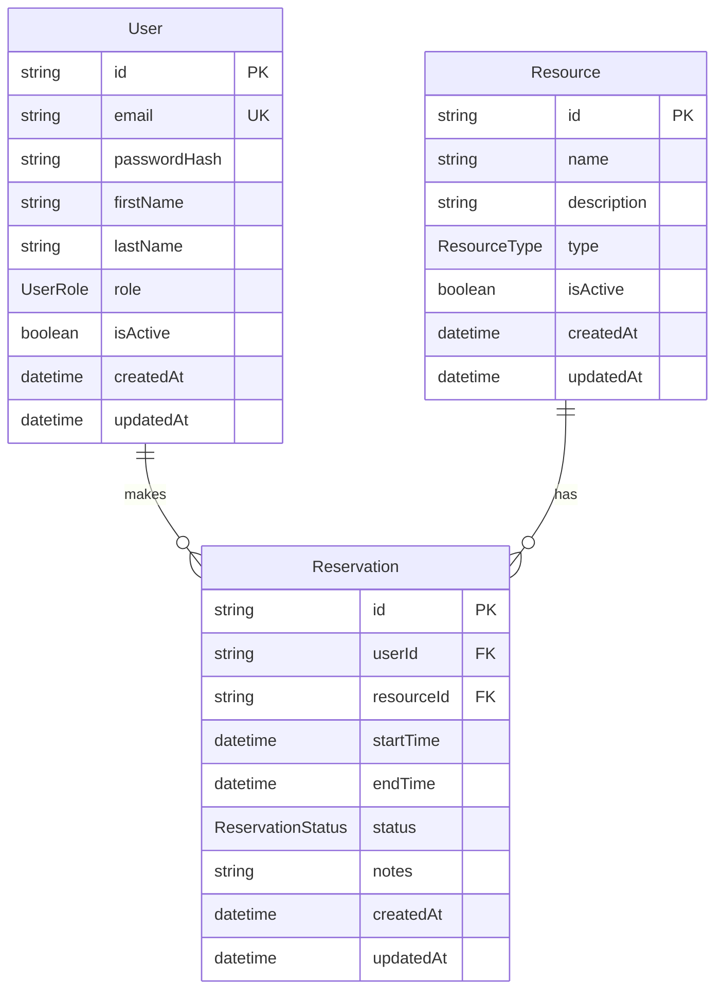

# Data Model and Database Structure Plan

## Context

The Prisma schema at [backend/prisma/schema.prisma](backend/prisma/schema.prisma) is currently empty (datasource + generator only). This plan defines the first application schema based on project requirements:

- Users browse resources, view availability, and make reservations
- Administrators will manage resources and reservations (role distinction needed)
- **Exclusive reservations**: one active reservation per resource per time slot
- **Resource types**: categorized via `ResourceType` enum

No API endpoints, services, or auth logic are in scope — only schema design, migration, and minimal supporting files.

---

## Entity Relationship Diagram



---

## Enums

| Enum | Values | Purpose |
|------|--------|---------|
| `UserRole` | `USER`, `ADMIN` | Distinguishes regular users from administrators |
| `ResourceType` | `ROOM`, `EQUIPMENT`, `VEHICLE`, `OTHER` | Categorizes bookable resources |
| `ReservationStatus` | `PENDING`, `CONFIRMED`, `CANCELLED` | Tracks reservation lifecycle |

**Defaults:**
- `User.role` → `USER`
- `Reservation.status` → `CONFIRMED` (simple flow for v1; `PENDING` reserved for future approval workflows)

---

## Models

### User

| Field | Type | Constraints | Notes |
|-------|------|-------------|-------|
| `id` | `String` | PK, `@default(cuid())` | Opaque, URL-safe IDs |
| `email` | `String` | `@unique` | Login identifier (auth implemented later) |
| `passwordHash` | `String` | required | Stored hash only; never plain text |
| `firstName` | `String` | required | Display name |
| `lastName` | `String` | required | Display name |
| `role` | `UserRole` | `@default(USER)` | Admin capability flag |
| `isActive` | `Boolean` | `@default(true)` | Soft deactivation without deletion |
| `createdAt` | `DateTime` | `@default(now())` | Audit |
| `updatedAt` | `DateTime` | `@updatedAt` | Audit |

**Relations:** `reservations Reservation[]`

---

### Resource

| Field | Type | Constraints | Notes |
|-------|------|-------------|-------|
| `id` | `String` | PK, `@default(cuid())` | |
| `name` | `String` | required | e.g. "Conference Room A" |
| `description` | `String?` | optional | Longer description |
| `type` | `ResourceType` | required | From enum |
| `isActive` | `Boolean` | `@default(true)` | Inactive resources hidden from booking |
| `createdAt` | `DateTime` | `@default(now())` | |
| `updatedAt` | `DateTime` | `@updatedAt` | |

**Relations:** `reservations Reservation[]`

No `capacity` field — exclusive model means effective capacity is always 1.

---

### Reservation

| Field | Type | Constraints | Notes |
|-------|------|-------------|-------|
| `id` | `String` | PK, `@default(cuid())` | |
| `userId` | `String` | FK → User | Who booked |
| `resourceId` | `String` | FK → Resource | What was booked |
| `startTime` | `DateTime` | required | UTC stored; timezone handled at API layer later |
| `endTime` | `DateTime` | required | Must be after `startTime` |
| `status` | `ReservationStatus` | `@default(CONFIRMED)` | |
| `notes` | `String?` | optional | User-provided context |
| `createdAt` | `DateTime` | `@default(now())` | |
| `updatedAt` | `DateTime` | `@updatedAt` | |

**Relations:**
- `user User @relation(fields: [userId], references: [id], onDelete: Restrict)`
- `resource Resource @relation(fields: [resourceId], references: [id], onDelete: Restrict)`

**Indexes:**
```prisma
@@index([resourceId, startTime, endTime])  // availability / overlap queries
@@index([userId])                          // list user's reservations
@@index([status])                          // filter active vs cancelled
```

**Delete policy:** `onDelete: Restrict` on both FKs — prevents accidental cascade deletion of historical reservations when a user or resource is deactivated. Deactivation uses `isActive` instead of hard deletes.

---

## Availability and Overlap Rules (documented, not implemented yet)

Exclusive booking logic (for future service layer):

```
Two reservations overlap if:
  existing.startTime < new.endTime AND existing.endTime > new.startTime

Only count reservations where status IN (PENDING, CONFIRMED)
CANCELLED reservations do not block availability
Only isActive = true resources are bookable
```

Overlap prevention will live in the **ReservationService** (application layer), not in the schema migration. A PostgreSQL `EXCLUDE` constraint on `(resourceId, tsrange(startTime, endTime))` could be added later via a raw SQL migration for stronger DB-level guarantees — deferred to keep the initial migration simple and Prisma-native.

`endTime > startTime` validation will also be enforced in the service/validation layer (Prisma schema alone cannot express this check cleanly).

---

## Prisma Schema (target)

The full schema to add to [backend/prisma/schema.prisma](backend/prisma/schema.prisma):

```prisma
enum UserRole {
  USER
  ADMIN
}

enum ResourceType {
  ROOM
  EQUIPMENT
  VEHICLE
  OTHER
}

enum ReservationStatus {
  PENDING
  CONFIRMED
  CANCELLED
}

model User {
  id           String        @id @default(cuid())
  email        String        @unique
  passwordHash String
  firstName    String
  lastName     String
  role         UserRole      @default(USER)
  isActive     Boolean       @default(true)
  createdAt    DateTime      @default(now())
  updatedAt    DateTime      @updatedAt
  reservations Reservation[]

  @@map("users")
}

model Resource {
  id           String        @id @default(cuid())
  name         String
  description  String?
  type         ResourceType
  isActive     Boolean       @default(true)
  createdAt    DateTime      @default(now())
  updatedAt    DateTime      @updatedAt
  reservations Reservation[]

  @@map("resources")
}

model Reservation {
  id         String            @id @default(cuid())
  userId     String
  resourceId String
  startTime  DateTime
  endTime    DateTime
  status     ReservationStatus @default(CONFIRMED)
  notes      String?
  createdAt  DateTime          @default(now())
  updatedAt  DateTime          @updatedAt
  user       User              @relation(fields: [userId], references: [id], onDelete: Restrict)
  resource   Resource          @relation(fields: [resourceId], references: [id], onDelete: Restrict)

  @@index([resourceId, startTime, endTime])
  @@index([userId])
  @@index([status])
  @@map("reservations")
}
```

**Note:** `@@map(...)` uses plural snake_case table names (`users`, `resources`, `reservations`) — a PostgreSQL convention that keeps Prisma model names PascalCase while DB tables remain conventional.

---

## Migration Plan

### Migration 1: `init_schema` (initial)

**Command:**
```bash
cd backend
npm run db:migrate -- --name init_schema
```

**Creates:**
- 3 PostgreSQL enum types: `UserRole`, `ResourceType`, `ReservationStatus`
- 3 tables: `users`, `resources`, `reservations`
- Unique constraint on `users.email`
- Foreign keys on `reservations.userId` and `reservations.resourceId` with `RESTRICT`
- Indexes listed above

**Prerequisites:**
- PostgreSQL running locally
- `DATABASE_URL` set in [backend/.env](backend/.env)
- Database `resource_reservation` created

**Generated artifact:** `backend/prisma/migrations/<timestamp>_init_schema/migration.sql`

After migration:
```bash
npm run db:generate   # regenerate Prisma Client with new types
```

### Future migrations (not in this task)

| Migration | Trigger |
|-----------|---------|
| `add_resource_location` | If resources need a physical location field |
| `add_reservation_overlap_constraint` | Raw SQL exclusion constraint for DB-level overlap prevention |
| `add_user_refresh_tokens` | When JWT refresh token auth is implemented |

---

## Optional Dev Seed

Add [backend/prisma/seed.ts](backend/prisma/seed.ts) with a minimal dev dataset:

- 1 admin user (`admin@example.com`, role `ADMIN`)
- 1 regular user (`user@example.com`, role `USER`)
- 2–3 sample resources (one of each type)
- 1 sample reservation

Register in [backend/package.json](backend/package.json):
```json
"prisma": { "seed": "tsx prisma/seed.ts" }
```

Password hashes use a placeholder bcrypt hash (documented in seed file). Run via `npx prisma db seed`.

This is optional but recommended for manual testing in later feature work.

---

## Backend Type Alignment

Add domain type files under [backend/src/models/](backend/src/models/) that re-export or wrap Prisma-generated types:

| File | Contents |
|------|----------|
| `user.model.ts` | Re-export `User`, `UserRole` from `@prisma/client` |
| `resource.model.ts` | Re-export `Resource`, `ResourceType` |
| `reservation.model.ts` | Re-export `Reservation`, `ReservationStatus` |
| `index.ts` | Barrel export |

These are thin re-exports — no duplication of field definitions. Repositories will import from `@prisma/client` or these model files consistently.

---

## Documentation Update

Add a **Database Schema** section to [README.md](README.md) covering:

- Entity descriptions and relationships
- Enum values
- Migration commands (`db:migrate`, `db:seed`, `db:studio`)
- Overlap/availability rules (brief)

---

## Implementation Checklist

1. Replace placeholder comment in `schema.prisma` with full schema
2. Run `prisma migrate dev --name init_schema` against local PostgreSQL
3. Run `prisma generate` to update the client
4. Add optional `seed.ts` and register in `package.json`
5. Add model re-export files in `backend/src/models/`
6. Update README with schema documentation
7. Verify with `prisma studio` or a quick query that tables and enums exist

---

## Decisions and Assumptions

| Decision | Rationale |
|----------|-----------|
| `cuid()` IDs | Prisma default; opaque, no sequential leakage |
| Exclusive model, no `capacity` | Matches your choice; simpler schema |
| `ResourceType` enum | Matches your choice; typed categories from day one |
| `onDelete: Restrict` | Preserves reservation history integrity |
| `isActive` soft flags | Preferred over hard deletes for users/resources |
| `passwordHash` on User | Schema-ready for auth; not implemented yet |
| UTC `DateTime` | Standard PostgreSQL timestamp; timezone handling deferred to API |
| Overlap in service layer | Keeps initial migration Prisma-native; DB constraint optional later |
| `@@map` snake_case tables | PostgreSQL naming convention without affecting TS model names |
