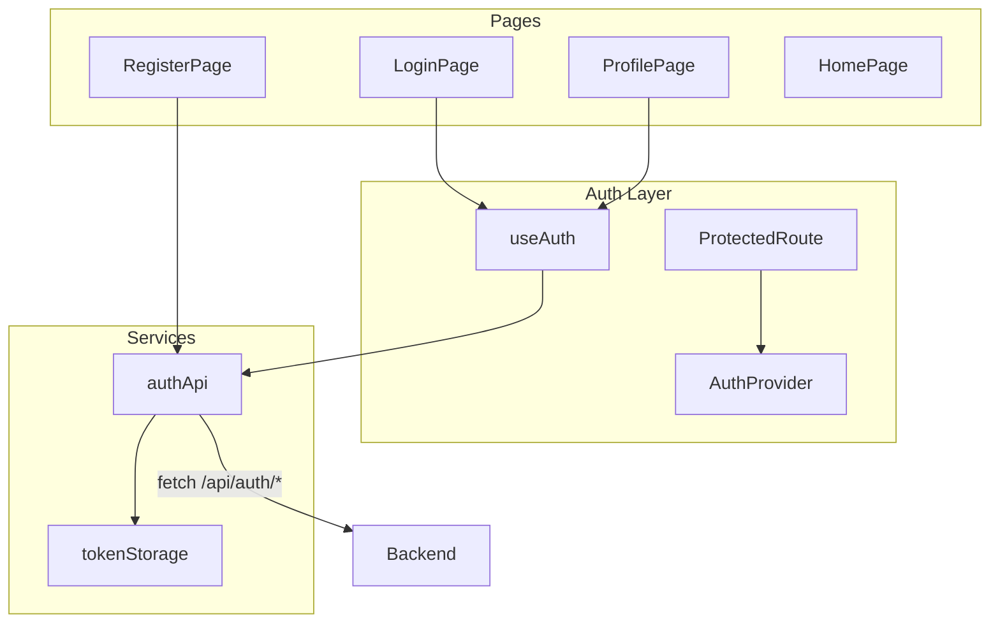

# Login and User Views UI Plan

## Context

The frontend at [frontend/src/](frontend/src/) is a minimal scaffold: a single [HomePage](frontend/src/pages/HomePage.tsx), basic [AppHeader](frontend/src/components/AppHeader.tsx), and one API helper in [api.ts](frontend/src/services/api.ts). There is no routing, auth state, or user-facing pages.

The backend auth API is implemented and available via Vite proxy (`/api` → `localhost:3000`):

| Endpoint | Purpose |
|----------|---------|
| `POST /api/auth/register` | Self-register |
| `POST /api/auth/login` | Returns access + refresh tokens |
| `POST /api/auth/refresh` | Rotate token pair |
| `POST /api/auth/logout` | Revoke refresh token |
| `GET /api/auth/me` | Current user profile |
| `POST /api/auth/change-password` | Change password |

**Scope for this phase:**
- Login, Register, Profile (view account + change password)
- Auth state and protected routes
- **No** admin user management UI
- **No** resource/reservation UI (deferred)

---

## Architecture



---

## Dependencies

Add to [frontend/package.json](frontend/package.json):

| Package | Purpose |
|---------|---------|
| `react-router-dom` | Client-side routing |
| `@mui/material` | Component library (project-wide) |
| `@emotion/react` | MUI styling engine (required peer) |
| `@emotion/styled` | MUI styled components (required peer) |
| `@mui/icons-material` | Icons for nav, forms, feedback (optional but recommended) |

**MUI is the standard UI library for the entire frontend** — all current and future pages (resources, reservations, admin) will use MUI components and the shared theme.

---

## MUI Setup

### [frontend/src/theme/theme.ts](frontend/src/theme/theme.ts)

Create a shared theme with `createTheme()`:
- Primary/secondary palette (simple, professional defaults)
- Typography baseline
- Component overrides only where needed (e.g. `MuiButton`, `MuiTextField`)

### [frontend/src/main.tsx](frontend/src/main.tsx)

Wrap the app:

```tsx
<ThemeProvider theme={theme}>
  <CssBaseline />
  <AuthProvider>
    <App />
  </AuthProvider>
</ThemeProvider>
```

### Layout pattern

Use a shared [frontend/src/components/AppLayout.tsx](frontend/src/components/AppLayout.tsx):
- `Box` with min-height viewport
- `AppHeader` (MUI `AppBar`) at top
- `Container` for page content with consistent padding/max-width

Remove reliance on custom CSS in [index.css](frontend/src/index.css) and [App.css](frontend/src/App.css) — keep only minimal global resets if needed; MUI `CssBaseline` handles most defaults.

---

## Routing

Update [frontend/src/App.tsx](frontend/src/App.tsx) with `BrowserRouter`:

| Path | Component | Access |
|------|-----------|--------|
| `/` | `HomePage` | Public |
| `/login` | `LoginPage` | Public (redirect to `/profile` if logged in) |
| `/register` | `RegisterPage` | Public (redirect if logged in) |
| `/profile` | `ProfilePage` | Protected |

Use a `ProtectedRoute` wrapper that redirects unauthenticated users to `/login`.

Use a `GuestRoute` wrapper (optional) that redirects authenticated users away from `/login` and `/register` to `/profile`.

---

## Auth State Management

### [frontend/src/context/AuthContext.tsx](frontend/src/context/AuthContext.tsx)

React Context + Provider — no external state library.

**State:**
```typescript
interface AuthState {
  user: User | null;
  isAuthenticated: boolean;
  isLoading: boolean;
}
```

**Methods exposed via `useAuth()` hook:**
- `login(email, password)` — calls API, stores tokens, fetches `/me`, sets user
- `register(data)` — calls API, does **not** auto-login (matches backend: register returns user, no tokens)
- `logout()` — calls API with refresh token, clears storage, resets state
- `changePassword(current, newPassword)` — calls API, clears tokens (backend revokes sessions), redirects to login
- `refreshUser()` — re-fetch `/me` (e.g. on app load)

**Bootstrap on mount:**
1. Read tokens from storage
2. If access token exists → call `GET /api/auth/me`
3. If 401 → attempt token refresh via `POST /api/auth/refresh`
4. If refresh fails → clear storage, remain logged out

Wrap app in `<AuthProvider>` from [main.tsx](frontend/src/main.tsx).

---

## Token Storage

### [frontend/src/services/tokenStorage.ts](frontend/src/services/tokenStorage.ts)

Store in `localStorage` (acceptable for thesis/dev; document trade-off):

| Key | Value |
|-----|-------|
| `accessToken` | JWT access token |
| `refreshToken` | JWT refresh token |

Functions: `getTokens()`, `setTokens()`, `clearTokens()`

---

## API Layer

### [frontend/src/services/authApi.ts](frontend/src/services/authApi.ts)

| Function | Backend call |
|----------|-------------|
| `register(data)` | `POST /api/auth/register` |
| `login(data)` | `POST /api/auth/login` |
| `logout(refreshToken)` | `POST /api/auth/logout` |
| `refresh(refreshToken)` | `POST /api/auth/refresh` |
| `getMe(accessToken)` | `GET /api/auth/me` |
| `changePassword(accessToken, data)` | `POST /api/auth/change-password` |

### [frontend/src/services/apiClient.ts](frontend/src/services/apiClient.ts)

Shared fetch wrapper:
- Prefix `/api`
- Attach `Authorization: Bearer <accessToken>` when token provided
- Parse `{ data: T }` success envelope
- Parse `{ error: { message, details? } }` on failure; throw typed `ApiError`
- On 401 with refresh token available → attempt refresh once, retry original request (for future authenticated endpoints)

Refactor existing [api.ts](frontend/src/services/api.ts) to use `apiClient` or keep health fetch separate.

---

## Types

### [frontend/src/types/user.ts](frontend/src/types/user.ts)

Mirror backend `UserResponse`:

```typescript
export type UserRole = 'USER' | 'ADMIN';

export interface User {
  id: string;
  email: string;
  firstName: string;
  lastName: string;
  role: UserRole;
  isActive: boolean;
  createdAt: string;
  updatedAt: string;
}

export interface AuthTokens {
  accessToken: string;
  refreshToken: string;
  expiresIn: number;
}
```

### [frontend/src/types/api.ts](frontend/src/types/api.ts)

```typescript
export interface ApiResponse<T> { data: T }
export interface ApiErrorDetail { field: string; message: string }
export class ApiError extends Error { ... }
```

---

## Pages and Components

### Login — [frontend/src/pages/LoginPage.tsx](frontend/src/pages/LoginPage.tsx)

- Wrapped in `AuthFormLayout` inside `AppLayout`
- MUI `Stack` of `TextField`s: email, password
- `Button type="submit"` → `useAuth().login()`
- MUI `Link` (react-router) to `/register`
- `Alert severity="error"` on API failure
- Redirect to `/profile` on success

### Register — [frontend/src/pages/RegisterPage.tsx](frontend/src/pages/RegisterPage.tsx)

- `AuthFormLayout` + `Stack` of `TextField`s: firstName, lastName, email, password, confirmPassword
- Client-side validation: passwords match, min 8 chars; show errors via `TextField` `error`/`helperText`
- Submit → `authApi.register()` then redirect to `/login` with success state (shown as `Alert severity="success"` on login page via router state)
- MUI `Link` to `/login`

### Profile — [frontend/src/pages/ProfilePage.tsx](frontend/src/pages/ProfilePage.tsx)

Two MUI `Card` sections inside a `Stack` or `Grid`:

**Account info card**
- `CardHeader` with user name
- `CardContent` with `Typography` / `List` showing email, role, member since
- Data from `useAuth().user`

**Change password card**
- `CardHeader` title "Change password"
- `TextField`s for current, new, confirm passwords
- `Button` submit → `useAuth().changePassword()`
- `Alert severity="success"` then redirect to `/login` (sessions revoked)

### Shared components (MUI-based)

| Component | MUI building blocks | Purpose |
|-----------|---------------------|---------|
| [AppLayout.tsx](frontend/src/components/AppLayout.tsx) | `Box`, `Container` | Consistent page shell |
| [AuthFormLayout.tsx](frontend/src/components/AuthFormLayout.tsx) | `Paper`, `Typography`, `Alert`, `Stack` | Centered auth card for login/register |
| [ProtectedRoute.tsx](frontend/src/components/ProtectedRoute.tsx) | `CircularProgress`, `Box` | Redirect to `/login` if not authenticated; show loader while bootstrapping |
| [AppHeader.tsx](frontend/src/components/AppHeader.tsx) | `AppBar`, `Toolbar`, `Button`, `Typography` | Auth-aware top navigation |

**Form inputs:** use MUI `TextField` directly in pages (with `type="email"`, `type="password"`, `error`, `helperText` props) — no custom `FormField` wrapper unless repetition warrants a thin typed wrapper later.

**Buttons:** MUI `Button` with `variant="contained"` for primary actions, `variant="text"` for nav links.

**Feedback:** MUI `Alert` for form-level errors/success; `CircularProgress` on submit buttons via `loading` prop (MUI v6+) or disabled + spinner pattern.

### Update [AppHeader.tsx](frontend/src/components/AppHeader.tsx)

- MUI `AppBar` + `Toolbar` with app title
- `Button` links: Home, Profile (if logged in), Login/Register (if logged out)
- Show user name (`Typography`) + Logout `Button` when authenticated
- Logout calls `useAuth().logout()`

---

## UI / UX Guidelines (MUI)

- Use the shared theme from [theme.ts](frontend/src/theme/theme.ts) — no ad-hoc inline colors
- Auth pages: centered `Paper` card, `maxWidth="sm"` Container (~400px effective)
- Profile page: `Container maxWidth="md"` with stacked `Card`s (~600–800px)
- Forms: MUI `TextField` with built-in label, `helperText`, and `error` props (accessible by default)
- Disable submit `Button` or show loading state while request is in flight
- Use MUI `Alert` for form-level errors/success (no separate toast library)
- Use `@mui/icons-material` sparingly for nav/actions (e.g. Logout, Person)
- Future features (resources, reservations, admin) must use the same MUI theme and layout patterns

---

## File Structure (new/modified)

```
frontend/src/
├── theme/
│   └── theme.ts               (MUI createTheme — project-wide)
├── context/
│   └── AuthContext.tsx
├── components/
│   ├── AppLayout.tsx          (Box + Container shell)
│   ├── AppHeader.tsx          (MUI AppBar — modified)
│   ├── AuthFormLayout.tsx     (centered Paper card)
│   └── ProtectedRoute.tsx
├── pages/
│   ├── HomePage.tsx           (modified — MUI Typography/Card)
│   ├── LoginPage.tsx
│   ├── RegisterPage.tsx
│   └── ProfilePage.tsx
├── hooks/
│   └── useAuth.ts             (re-export from context)
├── services/
│   ├── apiClient.ts
│   ├── authApi.ts
│   └── tokenStorage.ts
├── types/
│   ├── user.ts
│   └── api.ts
├── App.tsx                    (modified — router)
└── main.tsx                   (modified — ThemeProvider + AuthProvider)
```

---

## Testing Strategy

| Test file | Coverage |
|-----------|----------|
| `LoginPage.test.tsx` | Renders form; submit calls login; shows error on failure |
| `RegisterPage.test.tsx` | Validates password match; submits register |
| `ProfilePage.test.tsx` | Displays user info; change password form validation |
| `AuthContext.test.tsx` | Login sets user; logout clears state; bootstrap from storage |
| `authApi.test.ts` | Mock fetch; verify correct endpoints and headers |
| `tokenStorage.test.ts` | get/set/clear tokens |
| `ProtectedRoute.test.tsx` | Redirects when unauthenticated |

Mock `fetch` globally in tests. Wrap components in `ThemeProvider`, `MemoryRouter`, and `AuthProvider` for page tests (add test utility [frontend/src/test/renderWithProviders.tsx](frontend/src/test/renderWithProviders.tsx)).

---

## Error Handling

| Scenario | UI behavior |
|----------|-------------|
| Invalid login credentials | Show backend message ("Invalid email or password") |
| Validation errors (400) | Show field-level errors from `error.details` if present |
| Network failure | Generic "Unable to connect" message |
| Expired session on profile | Redirect to login |
| Password change success | Success message + redirect to login |

---

## Implementation Order

1. Install MUI packages; create `theme.ts`; wrap app with `ThemeProvider` + `CssBaseline`
2. Add `react-router-dom`; set up routes in `App.tsx`
3. Add types (`user.ts`, `api.ts`)
4. Implement `tokenStorage.ts` and `apiClient.ts`
5. Implement `authApi.ts`
6. Build `AuthContext` + `useAuth` hook
7. Add `AppLayout`, `AuthFormLayout`, `ProtectedRoute`
8. Build `LoginPage`, `RegisterPage`, `ProfilePage` with MUI components
9. Update `AppHeader` (MUI AppBar) with auth-aware navigation
10. Update `HomePage` with MUI welcome content + links
11. Add `renderWithProviders` test helper; write tests
12. Update README with frontend auth usage and MUI note

---

## Out of Scope

- Admin user management UI (`/admin/users`)
- Resource browsing UI
- Reservation UI
- Password reset / forgot password
- OAuth / social login
- Persistent "remember me" beyond localStorage
- Alternative CSS frameworks (Tailwind, Bootstrap) — MUI is the project standard

---

## Decisions Summary

| Decision | Choice |
|----------|--------|
| Routing | react-router-dom |
| Auth state | React Context (no Redux) |
| Token storage | localStorage |
| Post-register flow | Redirect to login (no auto-login) |
| Post-password-change | Redirect to login (sessions revoked) |
| Admin UI | Deferred |
| Component library | MUI (`@mui/material`) — project-wide |
| Styling | MUI theme + Emotion; `CssBaseline` for resets |
| Icons | `@mui/icons-material` |
