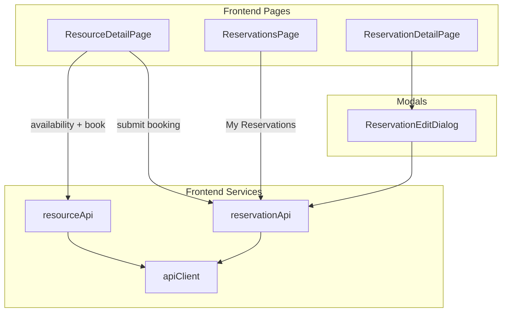

# Reservation CRUD Plan

## Context

The backend already implements reservation CRUD at `/api/reservations` with overlap prevention in the service layer:

| Method | Path | Auth | Behavior |
|--------|------|------|----------|
| `GET` | `/` | Authenticated | List (users: own only; admin: all + filters) |
| `GET` | `/:id` | Owner or admin | Detail |
| `POST` | `/` | Authenticated | Create (`userId` from JWT) |
| `PATCH` | `/:id` | Owner or admin | Update times/notes/status |
| `DELETE` | `/:id` | Owner or admin | Soft cancel (`status = CANCELLED`) |

**Overlap logic** ([reservation.repository.ts](backend/src/repositories/reservation.repository.ts)):

```typescript
// Blocks if same resourceId and PENDING|CONFIRMED reservation overlaps:
// existing.startTime < new.endTime AND existing.endTime > new.startTime
findOverlapping(resourceId, startTime, endTime, excludeId?)
```

**Scope for this phase (user-only):**
- **`/reservations` — My Reservations:** authenticated list of the current user's bookings with filters, edit, and cancel
- **Book on resource detail:** `/resources/:id` shows availability + inline booking form (primary create flow)
- **Reservation detail:** `/reservations/:id` view, reschedule (modal), cancel
- Backend hardening: availability APIs, stricter booking rules, expanded tests

**Deferred to later phase:**
- Admin resource create/edit modals on [ResourcesPage](frontend/src/pages/ResourcesPage.tsx)
- Admin all-reservations dashboard
- Any `AdminRoute` or admin-only UI
- Calendar/time-grid UI, pagination, business-hours rules
- DB-level exclusion constraints / full race-condition protection

---

## Architecture



---

## Phase 1: Backend Hardening

### 1. Availability APIs (new)

**A. Slot check** — `GET /api/resources/:id/availability`

Query params (Zod in [resource.validation.ts](backend/src/validation/resource.validation.ts)):

```typescript
{
  startTime: z.string().datetime(),
  endTime: z.string().datetime(),
  excludeReservationId?: z.string().min(1).optional(),
}
```

Response: `{ data: { available: boolean } }`

**B. Busy intervals** — `GET /api/resources/:id/bookings`

Query params: `{ from: z.string().datetime(), to: z.string().datetime() }`

Response:

```typescript
{
  data: Array<{ startTime: string; endTime: string; status: 'PENDING' | 'CONFIRMED' }>
}
```

- Non-cancelled reservations in range; **no user PII** (public-safe)
- Wire in [resource.routes.ts](backend/src/routes/resource.routes.ts) **before** `GET /:id`

Default UI range: next 30 days (client-side).

### 2. Stricter booking rules

Update [reservation.service.ts](backend/src/services/reservation.service.ts):

| Rule | Behavior |
|------|----------|
| Past bookings | Reject create/update if `startTime < now` |
| Cancelled reservations | Reject PATCH on `CANCELLED` |
| Cancel idempotency | `DELETE` on already-cancelled returns current reservation |
| User list filters | Allow `resourceId` and `status` filters scoped to own `userId` |

### 3. Backend tests

Expand [reservation.service.test.ts](backend/src/services/reservation.service.test.ts) + bookings-in-range and slot availability tests.

---

## Phase 2: Frontend — Types and API

### Types — [frontend/src/types/reservation.ts](frontend/src/types/reservation.ts)

`Reservation`, `ReservationStatus`, `CreateReservationInput`, `UpdateReservationInput`, `ListReservationsQuery`, `ResourceBooking`.

### API

**[frontend/src/services/reservationApi.ts](frontend/src/services/reservationApi.ts)** — all authenticated via `getTokens()`:

```typescript
listReservations(query?, accessToken): Promise<Reservation[]>
getReservation(id, accessToken): Promise<Reservation>
createReservation(data, accessToken): Promise<Reservation>
updateReservation(id, data, accessToken): Promise<Reservation>
cancelReservation(id, accessToken): Promise<Reservation>
```

**[frontend/src/services/resourceApi.ts](frontend/src/services/resourceApi.ts)** — public read extensions only:

```typescript
getResourceBookings(id, from, to): Promise<ResourceBooking[]>
checkAvailability(id, startTime, endTime, excludeReservationId?): Promise<{ available: boolean }>
```

No admin resource mutations in this phase.

### Utils

- [frontend/src/utils/reservationLabels.ts](frontend/src/utils/reservationLabels.ts)
- [frontend/src/utils/dateTime.ts](frontend/src/utils/dateTime.ts)

Native `TextField type="datetime-local"`.

---

## Phase 3: Resource Detail — Availability + Booking

### ResourceDetailPage — [frontend/src/pages/ResourceDetailPage.tsx](frontend/src/pages/ResourceDetailPage.tsx)

Three sections (`Stack` of `Card`s):

**1. Resource info** (existing — no admin edit button in this phase)

**2. Availability**
- Date-range filter (default next 30 days)
- `List` of busy intervals from `getResourceBookings`
- Empty: "No upcoming bookings in this period"

**3. Book this resource** (authenticated)
- Login prompt if guest
- Inline form: start/end datetime, notes
- Debounced `checkAvailability` feedback
- Submit → `createReservation` → redirect to `/reservations/:id`
- Refresh availability list on success

---

## Phase 4: My Reservations + Detail

### Routing — [frontend/src/App.tsx](frontend/src/App.tsx)

| Path | Component | Access |
|------|-----------|--------|
| `/reservations` | `ReservationsPage` | `ProtectedRoute` |
| `/reservations/:id` | `ReservationDetailPage` | `ProtectedRoute` |

### ReservationsPage — [frontend/src/pages/ReservationsPage.tsx](frontend/src/pages/ReservationsPage.tsx)

**Title:** "My Reservations"

- `AppLayout maxWidth="lg"`
- Filter toolbar: status (`Select` — Active / Cancelled / All)
- MUI `Table`: resource name (link to `/resources/:id`), time range, status chip, row actions
- Row click → `/reservations/:id`
- Row actions: **Edit** (opens edit flow), **Cancel** (confirm dialog) — disabled for cancelled
- Empty state: "You have no reservations" + **Browse resources** button → `/resources`
- Data: `listReservations({ status? })` — backend scopes to current user automatically
- No standalone create page; new bookings only from resource detail

### ReservationDetailPage — [frontend/src/pages/ReservationDetailPage.tsx](frontend/src/pages/ReservationDetailPage.tsx)

- Resource name (link to `/resources/:id`), time range, status, notes
- **Edit** → `ReservationEditDialog` (reschedule + notes)
- **Cancel** → confirm `Dialog`
- Back link to **My reservations**
- Disabled actions when `CANCELLED`

### ReservationEditDialog — [frontend/src/components/ReservationEditDialog.tsx](frontend/src/components/ReservationEditDialog.tsx)

- Times + notes; resource fixed
- `checkAvailability` with `excludeReservationId`
- Submit → `updateReservation`

### Navigation

- [AppHeader.tsx](frontend/src/components/AppHeader.tsx): **My reservations** → `/reservations` (when logged in)
- [HomePage.tsx](frontend/src/pages/HomePage.tsx): authenticated CTA to My reservations

---

## UI / UX Guidelines (MUI)

- My Reservations: same table/filter patterns as [ResourcesPage](frontend/src/pages/ResourcesPage.tsx)
- Edit dialog: `Dialog maxWidth="sm" fullWidth`
- Status chips: CONFIRMED = success, PENDING = warning, CANCELLED = default/outlined
- Booking form embedded in `Card` on resource detail

---

## Error Handling

| Scenario | UI behavior |
|----------|-------------|
| Overlap (409) | Inline error on booking/edit form |
| Past time (400) | Backend message |
| Inactive resource | Disable booking section |
| Unauthenticated | Alert + login link on resource detail |
| Edit cancelled | Disabled edit/cancel on detail |

---

## File Structure

```
frontend/src/
├── components/ReservationEditDialog.tsx
├── types/reservation.ts
├── services/reservationApi.ts
├── services/resourceApi.ts          (bookings + availability only)
├── utils/reservationLabels.ts
├── utils/dateTime.ts
├── pages/ResourceDetailPage.tsx     (availability + booking)
├── pages/ReservationsPage.tsx       (My Reservations)
├── pages/ReservationDetailPage.tsx
├── components/AppHeader.tsx
├── pages/HomePage.tsx
└── App.tsx
```

---

## Testing Strategy

| Test file | Coverage |
|-----------|----------|
| `reservationApi.test.ts` | CRUD + auth headers |
| `resourceApi.test.ts` | bookings + availability query strings |
| `ResourceDetailPage.test.tsx` | Availability list; booking form; login prompt |
| `ReservationsPage.test.tsx` | My Reservations list; filters; empty state |
| `ReservationDetailPage.test.tsx` | Detail; edit modal; cancel |

---

## Implementation Order

1. Backend: availability + bookings endpoints; harden rules; tests
2. Frontend: types, APIs, utils
3. Extend `ResourceDetailPage` (availability + booking)
4. Build `ReservationsPage` (My Reservations)
5. Build `ReservationDetailPage` + `ReservationEditDialog`
6. Routes and navigation (AppHeader, HomePage)
7. Tests + README

---

## Out of Scope (this phase)

- Admin resource create/edit/deactivate modals
- Admin reservations management
- `/reservations/new` standalone page
- Calendar/grid views, pagination, recurring bookings

---

## Decisions Summary

| Decision | Choice |
|----------|--------|
| Reservations hub | `/reservations` — My Reservations (protected) |
| Create reservation | Inline form on `/resources/:id` |
| Edit reservation | Modal on `/reservations/:id` |
| Admin features | Deferred entirely |
| Availability | `GET /resources/:id/bookings` + slot check endpoint |
| UI audience | Authenticated users — own bookings only |
| Date inputs | Native `datetime-local` |
| UI library | MUI (existing patterns) |
