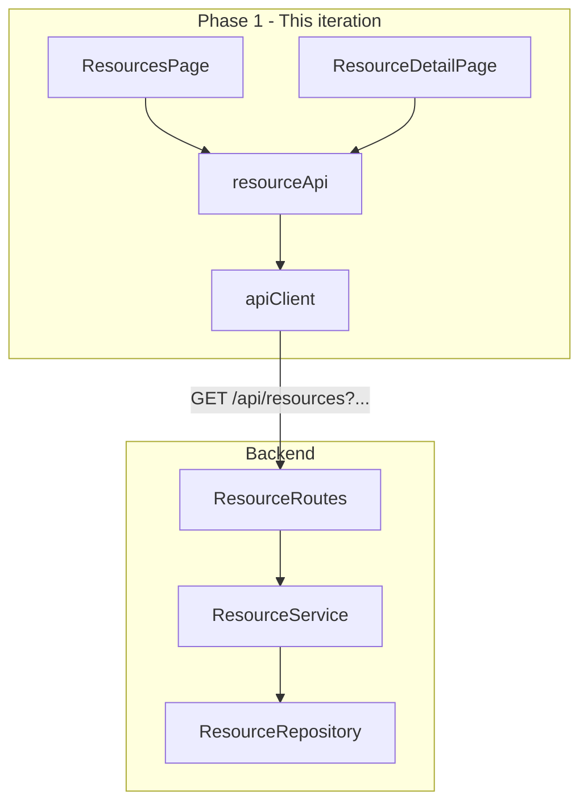

# Resource Management Plan

## Context

The backend already exposes full resource CRUD at `/api/resources` ([resource.routes.ts](backend/src/routes/resource.routes.ts)):

| Method | Path | Auth | Behavior |
|--------|------|------|----------|
| `GET` | `/` | Public | List (only `?active=true\|false` today) |
| `GET` | `/:id` | Public | Detail |
| `POST` | `/` | Admin | Create |
| `PATCH` | `/:id` | Admin | Update (incl. reactivate via `isActive: true`) |
| `DELETE` | `/:id` | Admin | Soft-deactivate (`isActive: false`) |

The Prisma `Resource` model ([schema.prisma](backend/prisma/schema.prisma)): `id`, `name`, `description?`, `type` (`ROOM` \| `EQUIPMENT` \| `VEHICLE` \| `OTHER`), `isActive`, timestamps.

The frontend has MUI, routing, `apiClient`, and auth — but **no resource types, API service, or pages** yet. There is also **no role-based route guard** (`AdminRoute`).

**Scope for this phase (per your choice):**
- Public browse UI: list, search, filter (read-only)
- Backend list API enhancements to support search/filter
- Backend tests for resource service/repository

**Deferred to next phase:**
- Admin CRUD UI (`/admin/resources`) for create, edit, deactivate/reactivate
- Reservation UI (unchanged)

---

## Architecture



Phase 2 (deferred) adds `AdminResourcesPage` + `ResourceFormDialog` behind `AdminRoute`, calling `POST`/`PATCH`/`DELETE`.

---

## Phase 1: Backend — Search and Filter

### Extend list query validation

Update [resource.validation.ts](backend/src/validation/resource.validation.ts):

```typescript
export const listResourcesQuerySchema = z.object({
  active: z.enum(['true', 'false']).optional(),
  type: z.nativeEnum(ResourceType).optional(),
  search: z.string().trim().min(1).max(100).optional(),
});
```

### Extend repository filters

Update [resource.repository.ts](backend/src/repositories/resource.repository.ts) `ResourceFilters`:

```typescript
interface ResourceFilters {
  isActive?: boolean;
  type?: ResourceType;
  search?: string;  // case-insensitive match on name OR description
}
```

Prisma `where` (conceptual):

```typescript
{
  ...(isActive !== undefined && { isActive }),
  ...(type && { type }),
  ...(search && {
    OR: [
      { name: { contains: search, mode: 'insensitive' } },
      { description: { contains: search, mode: 'insensitive' } },
    ],
  }),
}
```

Keep `orderBy: { name: 'asc' }`. **No pagination** in this phase (thesis-scale dataset; can add `page`/`limit` later).

### Wire through service

Update [resource.service.ts](backend/src/services/resource.service.ts) `listResources()` to map query params → `ResourceFilters`.

### Default behavior for public browse

The browse UI will default to **`active=true`** so deactivated resources are hidden from regular users. Admins can still manage inactive resources via API (Phase 2 UI) or by passing `?active=false`.

### Backend tests (new)

| File | Coverage |
|------|----------|
| `backend/src/services/resource.service.test.ts` | list with filters, getById, create, update, deactivate, not-found |
| `backend/src/repositories/resource.repository.test.ts` | optional; service tests with mocked repo may suffice |

Follow existing patterns from [auth.routes.test.ts](backend/src/routes/auth.routes.test.ts) / reservation service tests.

---

## Phase 1: Frontend — Public Browse UI

### Types — [frontend/src/types/resource.ts](frontend/src/types/resource.ts)

Mirror backend DTO:

```typescript
export type ResourceType = 'ROOM' | 'EQUIPMENT' | 'VEHICLE' | 'OTHER';

export interface Resource {
  id: string;
  name: string;
  description: string | null;
  type: ResourceType;
  isActive: boolean;
  createdAt: string;
  updatedAt: string;
}

export interface ListResourcesQuery {
  active?: 'true' | 'false';
  type?: ResourceType;
  search?: string;
}
```

Admin input types (`CreateResourceInput`, `UpdateResourceInput`) can be added now for Phase 2 readiness or when admin UI starts.

### API service — [frontend/src/services/resourceApi.ts](frontend/src/services/resourceApi.ts)

```typescript
listResources(query?: ListResourcesQuery): Promise<Resource[]>
getResource(id: string): Promise<Resource>
```

Build query string from optional params. Use `apiRequest` **without** token (public reads). Admin mutations deferred.

### Routing — [frontend/src/App.tsx](frontend/src/App.tsx)

| Path | Component | Access |
|------|-----------|--------|
| `/resources` | `ResourcesPage` | Public |
| `/resources/:id` | `ResourceDetailPage` | Public |

### Pages

**ResourcesPage** — [frontend/src/pages/ResourcesPage.tsx](frontend/src/pages/ResourcesPage.tsx)

- `AppLayout maxWidth="lg"`
- **Filter toolbar** (MUI `Stack` / `Paper`):
  - `TextField` search with debounce (~300ms) → updates URL search params or local state that triggers refetch
  - `Select` for type filter (All, Room, Equipment, Vehicle, Other)
  - `ToggleButtonGroup` or `Select` for status: Active (default) / All / Inactive
- **Results**: MUI `Table` or responsive `Card` grid showing name, type, description excerpt, active badge
- Row/card click → navigate to `/resources/:id`
- Loading: `CircularProgress`; empty: `Typography`; error: `Alert`
- Fetch on mount and when filters change

**ResourceDetailPage** — [frontend/src/pages/ResourceDetailPage.tsx](frontend/src/pages/ResourceDetailPage.tsx)

- `AppLayout maxWidth="md"`
- `Card` with name, type chip, description, active status, member-since-style created date
- Back link to `/resources`
- 404-style message if resource not found

### Navigation updates

- [AppHeader.tsx](frontend/src/components/AppHeader.tsx): add **Resources** link (visible to all users)
- [HomePage.tsx](frontend/src/pages/HomePage.tsx): add **Browse resources** button → `/resources`

### Shared helpers (optional, keep minimal)

- `frontend/src/utils/resourceLabels.ts` — map `ResourceType` enum to display labels (e.g. `ROOM` → "Room")
- No custom wrapper components unless repetition warrants it

---

## Phase 2 (Deferred): Admin CRUD UI

Fully specified for the next iteration; **not built in this phase**.

### AdminRoute — [frontend/src/components/AdminRoute.tsx](frontend/src/components/AdminRoute.tsx)

Wrap `ProtectedRoute` logic + check `user?.role === 'ADMIN'`; redirect non-admins to `/` with optional `Alert`.

### Admin page — `/admin/resources`

Single management page with:

| Action | UI | API |
|--------|-----|-----|
| List | Same table as browse but default shows all statuses | `GET /api/resources` |
| Search/filter | Reuse toolbar pattern | query params |
| Create | "Add resource" opens dialog/drawer form | `POST /api/resources` |
| Edit | Row action opens form pre-filled | `PATCH /api/resources/:id` |
| Deactivate | Confirm dialog → "Remove" | `DELETE /api/resources/:id` |
| Reactivate | Row action for inactive rows | `PATCH` with `{ isActive: true }` |

**Form fields:** name, description (multiline), type (`Select`). Edit form adds active toggle.

**resourceApi additions:**

```typescript
createResource(data, accessToken): Promise<Resource>
updateResource(id, data, accessToken): Promise<Resource>
deactivateResource(id, accessToken): Promise<Resource>
```

Pass `accessToken` from `getTokens()` (same pattern as [authApi.ts](frontend/src/services/authApi.ts) `changePassword`).

**Nav:** show **Manage resources** in `AppHeader` only when `user.role === 'ADMIN'`.

---

## UI / UX Guidelines (MUI)

- Reuse shared theme from [theme.ts](frontend/src/theme/theme.ts)
- Browse page: filter bar in `Paper elevation={1}`, results in `TableContainer` or `Grid` of `Card`s
- Type displayed as MUI `Chip` with consistent color mapping
- Inactive resources: `Chip label="Inactive" color="default"` (browse defaults to hiding these)
- Mobile: stack filters vertically; table → cards at `sm` breakpoint if needed

---

## File Structure (Phase 1)

```
frontend/src/
├── types/resource.ts
├── services/resourceApi.ts
├── pages/ResourcesPage.tsx
├── pages/ResourceDetailPage.tsx
├── utils/resourceLabels.ts          (optional)
├── App.tsx                          (routes)
├── components/AppHeader.tsx         (nav link)
└── pages/HomePage.tsx               (CTA)

backend/src/
├── validation/resource.validation.ts   (extended query schema)
├── repositories/resource.repository.ts (extended filters)
├── services/resource.service.ts        (map query → filters)
└── services/resource.service.test.ts   (new)
```

Phase 2 adds: `AdminRoute.tsx`, `AdminResourcesPage.tsx`, `ResourceFormDialog.tsx`, admin `resourceApi` methods.

---

## Testing Strategy

### Frontend (Phase 1)

| Test file | Coverage |
|-----------|----------|
| `resourceApi.test.ts` | Mock fetch; verify query string building and endpoints |
| `ResourcesPage.test.tsx` | Renders list; filter changes trigger refetch; empty/error states |
| `ResourceDetailPage.test.tsx` | Displays resource; not-found handling |

Use existing [renderWithProviders.tsx](frontend/src/test/renderWithProviders.tsx). Mock `fetch` globally for page tests.

### Backend (Phase 1)

Service-level tests for filter combinations: no params, `active`, `type`, `search`, combined filters.

---

## Error Handling

| Scenario | UI behavior |
|----------|-------------|
| Network failure | `Alert`: "Unable to load resources" |
| Empty search results | "No resources match your filters" |
| Resource not found (detail) | Message + link back to list |
| 403 on admin API (Phase 2) | Redirect or error from `AdminRoute` |

---

## Out of Scope

- Reservation booking UI
- Admin user management UI
- Hard delete (blocked by FK + design; soft deactivate only)
- Pagination (defer unless needed)
- Availability calendar / time-slot views
- Duplicate-name validation
- Bulk import/export

---

## Implementation Order

1. Extend backend list query validation, repository filters, and service mapping
2. Add `resource.service.test.ts`
3. Add frontend `types/resource.ts` and `services/resourceApi.ts`
4. Build `ResourcesPage` with search/filter toolbar and results list
5. Build `ResourceDetailPage`
6. Wire routes in `App.tsx`; update `AppHeader` and `HomePage`
7. Add frontend tests and update README with browse usage + extended API query params
8. *(Phase 2)* `AdminRoute`, admin page, CRUD forms, admin nav link

---

## Decisions Summary

| Decision | Choice |
|----------|--------|
| This phase UI | Public browse only (`/resources`, `/resources/:id`) |
| Admin CRUD UI | Deferred (API already supports it) |
| Delete semantics | Soft deactivate via `DELETE`; reactivate via `PATCH isActive: true` |
| Search | Server-side, case-insensitive on name + description |
| Filters | `type`, `active`, `search` query params |
| Default browse filter | Active resources only |
| Pagination | Not in this phase |
| UI library | MUI (existing theme and layout patterns) |
