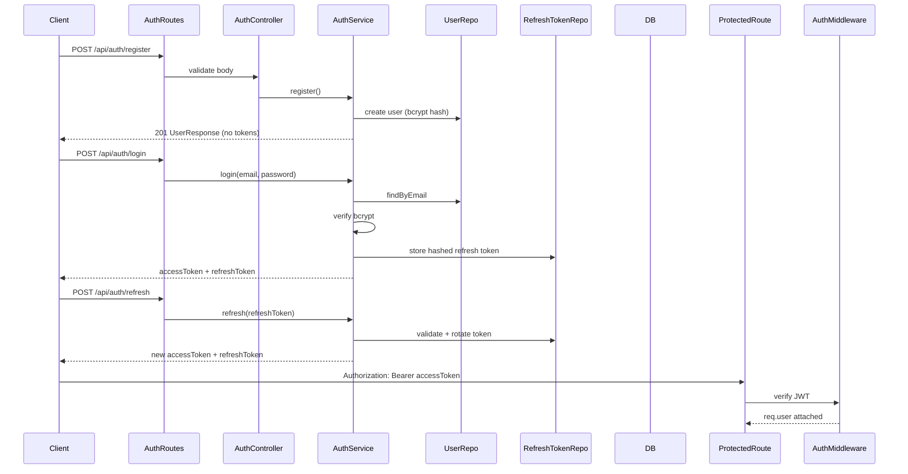
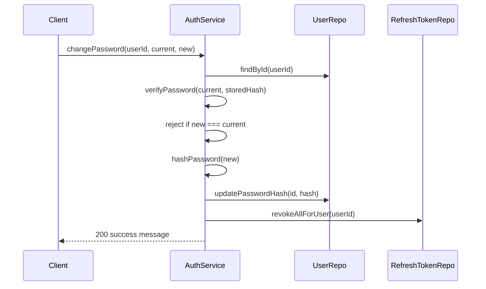

# Users and Authentication Plan

## Context

The User model already exists in [backend/prisma/schema.prisma](backend/prisma/schema.prisma) with `email`, `passwordHash`, `role` (`USER` | `ADMIN`), and `isActive`. Seed data uses a placeholder bcrypt hash for `"password"`. No auth code exists yet — [backend/src/config/env.ts](backend/src/config/env.ts) only exposes `port`, `nodeEnv`, and `databaseUrl`.

This plan builds on the pending **Backend Basic Structure** plan (Resource + Reservation CRUD). Auth will replace the temporary `userId`-in-body approach for reservations and gate admin-only operations.

**Your choices:**
- **JWT access + refresh tokens**
- **Self-registration** (new users get `USER` role; `ADMIN` assigned only via seed/admin promotion)

---

## Auth Architecture



---

## Schema Change: RefreshToken

Add a new model to [backend/prisma/schema.prisma](backend/prisma/schema.prisma):

```prisma
model RefreshToken {
  id        String   @id @default(cuid())
  userId    String
  tokenHash String   @unique
  expiresAt DateTime
  revokedAt DateTime?
  createdAt DateTime @default(now())
  user      User     @relation(fields: [userId], references: [id], onDelete: Cascade)

  @@index([userId])
  @@map("refresh_tokens")
}
```

Update `User` model to add: `refreshTokens RefreshToken[]`

**Migration:** `add_refresh_tokens` via `npm run db:migrate`

**Design notes:**
- Store **hashed** refresh tokens (SHA-256), never plain text — same principle as passwords
- `onDelete: Cascade` on refresh tokens — when a user is hard-deleted, tokens go too (users are soft-deactivated in normal flow)
- **Token rotation:** each refresh invalidates the old token and issues a new one (detects token reuse/theft)

No changes needed to the existing `User` fields.

---

## Environment Variables

Add to [backend/.env.example](backend/.env.example) and [backend/src/config/env.ts](backend/src/config/env.ts):

| Variable | Description | Example |
|----------|-------------|---------|
| `JWT_ACCESS_SECRET` | Secret for signing access tokens | random 32+ char string |
| `JWT_REFRESH_SECRET` | Secret for signing refresh tokens | separate random string |
| `JWT_ACCESS_EXPIRES_IN` | Access token TTL | `15m` |
| `JWT_REFRESH_EXPIRES_IN` | Refresh token TTL | `7d` |

Access and refresh secrets must be **different**. Both required at startup.

---

## Dependencies

Add to [backend/package.json](backend/package.json):

| Package | Purpose |
|---------|---------|
| `bcrypt` | Password hashing (cost factor 10–12) |
| `jsonwebtoken` | JWT sign/verify |
| `@types/bcrypt` | TypeScript types (dev) |
| `@types/jsonwebtoken` | TypeScript types (dev) |

No passport or session libraries — keeps the stack minimal.

---

## API Endpoints

### Auth — `/api/auth`

| Method | Path | Auth | Description |
|--------|------|------|-------------|
| `POST` | `/register` | Public | Self-register as `USER` |
| `POST` | `/login` | Public | Authenticate; returns token pair |
| `POST` | `/refresh` | Public | Exchange refresh token for new token pair |
| `POST` | `/logout` | Public | Revoke refresh token |
| `GET` | `/me` | Authenticated | Get current authenticated user profile |
| `POST` | `/change-password` | Authenticated | Change own password; revokes all refresh tokens |

### Users — `/api/users` (protected)

| Method | Path | Auth | Description |
|--------|------|------|-------------|
| `GET` | `/` | Admin | List all users |
| `GET` | `/:id` | Admin | Get user by ID |
| `PATCH` | `/:id` | Admin | Update user (role, isActive, name) |
| `DELETE` | `/:id` | Admin | Soft-deactivate user (`isActive = false`) |

**Note:** `GET /api/auth/me` serves the authenticated user's own profile. Admin user management is under `/api/users`.

---

## Request/Response Shapes

### Register / Login body

```typescript
// register
{ email: string; password: string; firstName: string; lastName: string }

// login
{ email: string; password: string }

// change-password (authenticated)
{ currentPassword: string; newPassword: string }
```

### Token response (login, refresh)

```json
{
  "data": {
    "accessToken": "eyJ...",
    "refreshToken": "eyJ...",
    "expiresIn": 900
  }
}
```

### User response (never includes passwordHash)

```json
{
  "data": {
    "id": "clx...",
    "email": "user@example.com",
    "firstName": "Regular",
    "lastName": "User",
    "role": "USER",
    "isActive": true,
    "createdAt": "...",
    "updatedAt": "..."
  }
}
```

---

## Layered Structure

Follow the same patterns as the Backend Basic Structure plan.

### New files

```
src/
├── lib/
│   ├── jwt.ts              # sign/verify access + refresh tokens
│   └── password.ts         # hash/verify with bcrypt
├── validation/
│   └── auth.validation.ts  # register, login, refresh, change-password schemas
├── repositories/
│   ├── user.repository.ts  # extend: findByEmail, create, findAll, update, deactivate
│   └── refresh-token.repository.ts
├── services/
│   └── auth.service.ts     # register, login, refresh, logout, getMe, changePassword
├── controllers/
│   ├── auth.controller.ts
│   └── user.controller.ts
├── routes/
│   ├── auth.routes.ts
│   └── user.routes.ts
├── middleware/
│   ├── auth.middleware.ts       # authenticate (JWT verify)
│   └── authorize.middleware.ts  # authorize(UserRole.ADMIN)
└── models/
    ├── user.dto.ts              # UserResponse, AuthTokenResponse
    └── auth.model.ts            # JwtPayload, AuthenticatedRequest type
```

---

## Key Components

### [backend/src/lib/password.ts](backend/src/lib/password.ts)

- `hashPassword(plain: string): Promise<string>` — bcrypt with cost factor 12
- `verifyPassword(plain: string, hash: string): Promise<boolean>`

### [backend/src/lib/jwt.ts](backend/src/lib/jwt.ts)

- `signAccessToken(payload: JwtPayload): string`
- `signRefreshToken(payload: JwtPayload): string`
- `verifyAccessToken(token: string): JwtPayload`
- `verifyRefreshToken(token: string): JwtPayload`

**JwtPayload:**
```typescript
interface JwtPayload {
  sub: string;    // user id
  email: string;
  role: UserRole;
}
```

### [backend/src/middleware/auth.middleware.ts](backend/src/middleware/auth.middleware.ts)

- Reads `Authorization: Bearer <token>` header
- Verifies access token via `verifyAccessToken`
- Checks user `isActive` (lightweight DB lookup or trust JWT + check on sensitive ops)
- Attaches `req.user: { id, email, role }` to request
- Throws `UnauthorizedError` (401) on missing/invalid/expired token

Extend Express `Request` type via [backend/src/models/auth.model.ts](backend/src/models/auth.model.ts):

```typescript
interface AuthenticatedRequest extends Request {
  user: { id: string; email: string; role: UserRole };
}
```

### [backend/src/middleware/authorize.middleware.ts](backend/src/middleware/authorize.middleware.ts)

- Factory: `authorize(...roles: UserRole[])` — returns middleware
- Throws `ForbiddenError` (403) if `req.user.role` not in allowed roles
- Usage: `router.get('/', authenticate, authorize(UserRole.ADMIN), ...)`

### [backend/src/services/auth.service.ts](backend/src/services/auth.service.ts)

| Method | Logic |
|--------|-------|
| `register(data)` | Validate email unique; hash password; create user with role `USER`; return `UserResponse` |
| `login(email, password)` | Find user by email; verify active + password; generate token pair; hash + store refresh token; return tokens |
| `refresh(refreshToken)` | Verify JWT signature; find hashed token in DB; check not revoked/expired; **rotate** (revoke old, issue new pair) |
| `logout(refreshToken)` | Revoke token in DB |
| `getMe(userId)` | Return user profile |
| `changePassword(userId, currentPassword, newPassword)` | Verify current password; reject if new equals current; hash and store new password; **revoke all refresh tokens** for user; return success (no new tokens — user must re-login) |

**New error classes** (add to error middleware):
- `UnauthorizedError` (401) — invalid/missing credentials or token
- `ForbiddenError` (403) — insufficient role

### [backend/src/repositories/user.repository.ts](backend/src/repositories/user.repository.ts)

Extend beyond the Backend Structure plan stub:

| Method | Purpose |
|--------|---------|
| `findByEmail(email)` | Login / register duplicate check |
| `findById(id)` | Profile lookup |
| `create(data)` | Registration |
| `findAll()` | Admin list |
| `update(id, data)` | Admin update |
| `deactivate(id)` | Set `isActive = false` |
| `existsActive(id)` | Reservation validation |
| `updatePasswordHash(id, passwordHash)` | Store new bcrypt hash after password change |

### [backend/src/repositories/refresh-token.repository.ts](backend/src/repositories/refresh-token.repository.ts)

Add method used by password change:

| Method | Purpose |
|--------|---------|
| `revokeAllForUser(userId)` | Revoke all active refresh tokens for a user (called on password change) |

---

## Password Change

Authenticated users can change their own password via `POST /api/auth/change-password`.

### Flow



### Rules

- Requires valid access token (`authenticate` middleware)
- User can only change **their own** password (uses `req.user.id`)
- `currentPassword` must match stored hash — throw `UnauthorizedError` (401) on mismatch
- `newPassword` must meet same policy as registration (min 8 chars)
- `newPassword` must differ from `currentPassword` — throw `ValidationError` (400)
- On success: revoke **all** refresh tokens for the user (forces re-login on all devices)
- Does **not** issue new tokens — client must call `/login` again
- Access token remains valid until it expires (short TTL limits exposure)

### Admin password reset

Admins cannot change another user's password via this endpoint. Admin-initiated password reset for other users remains **out of scope** (deferred with forgot-password flow).

---

## Validation (Zod)

Add to [backend/src/validation/auth.validation.ts](backend/src/validation/auth.validation.ts):

| Schema | Rules |
|--------|-------|
| `registerSchema` | email (valid format), password (min 8 chars), firstName/lastName (non-empty, max 100) |
| `loginSchema` | email, password (non-empty) |
| `refreshSchema` | refreshToken (non-empty string) |
| `changePasswordSchema` | currentPassword (non-empty), newPassword (min 8 chars) |
| `updateUserSchema` | optional firstName, lastName, role, isActive — admin only |

Password policy: minimum 8 characters. No complexity rules for v1 (keeps validation simple). `changePasswordSchema` adds a service-level check that `newPassword !== currentPassword`.

---

## Integration with Resource/Reservation APIs

Update the Backend Basic Structure plan behavior when auth is in place:

| Endpoint | Auth change |
|----------|-------------|
| `GET /api/resources` | Public (no auth) — browse resources |
| `GET /api/resources/:id` | Public |
| `POST/PATCH/DELETE /api/resources` | **Admin only** (`authenticate` + `authorize(ADMIN)`) |
| `GET /api/reservations` | Authenticated — users see own; admins see all (filter by `?userId` admin-only) |
| `GET /api/reservations/:id` | Authenticated — owner or admin |
| `POST /api/reservations` | Authenticated — `userId` taken from `req.user.id`, **removed from request body** |
| `PATCH /api/reservations/:id` | Authenticated — owner or admin |
| `DELETE /api/reservations/:id` | Authenticated — owner or admin (cancel) |

This removes the temporary `userId`-in-body workaround from the backend structure plan.

---

## Security Considerations

| Concern | Approach |
|---------|----------|
| Password storage | bcrypt hash only; never log or return passwords |
| Refresh token storage | SHA-256 hash in DB; plain token sent to client once |
| Token rotation | Old refresh token revoked on each refresh |
| Role escalation | Registration always creates `USER`; only admin can promote to `ADMIN` |
| Inactive users | Reject login and reject token use for deactivated accounts |
| JWT secrets | Separate access/refresh secrets; required env vars |
| Logout | Revoke refresh token server-side |
| Password change | Verify current password; revoke all sessions on success |

**Deferred:** rate limiting on login, account lockout, email verification, forgot-password / password reset (unauthenticated recovery).

---

## Seed Update

Update [backend/prisma/seed.ts](backend/prisma/seed.ts):

- Replace placeholder hash with real bcrypt hash via `hashPassword('password')`
- Or import bcrypt directly in seed script to generate proper hashes

---

## Testing Strategy

| Test file | Coverage |
|-----------|----------|
| `auth.service.test.ts` | Register success/duplicate email; login success/wrong password/inactive user; refresh rotation; logout revocation; changePassword success/wrong current/same-as-current/revokes tokens |
| `auth.routes.test.ts` | POST register/login/refresh/logout/me/change-password via Supertest; 401 without token; 401 on wrong current password |
| `user.routes.test.ts` | Admin list/update/deactivate; 403 for non-admin |
| `auth.middleware.test.ts` | Valid token attaches user; expired/missing token returns 401 |

Mock repositories in service tests; mock auth middleware or use test tokens in route tests.

---

## Route Registration

Update [backend/src/routes/index.ts](backend/src/routes/index.ts):

```typescript
router.use('/auth', authRouter);
router.use('/users', userRouter);       // all routes require authenticate
router.use('/resources', resourceRouter);
router.use('/reservations', reservationRouter);
```

---

## Implementation Order

1. Add env vars + dependencies (`bcrypt`, `jsonwebtoken`)
2. Schema migration: `RefreshToken` model
3. Utilities: `password.ts`, `jwt.ts`
4. Error classes: `UnauthorizedError`, `ForbiddenError`
5. Extend `user.repository.ts`; add `refresh-token.repository.ts`
6. Validation schemas for auth
7. `auth.service.ts` with full token lifecycle
8. Auth middleware + authorize middleware
9. Auth controller + routes (including change-password)
10. User controller + routes (admin)
11. Password change flow + revoke-all refresh tokens
12. Update seed with real bcrypt hashes
13. Integrate auth into Resource/Reservation routes (when implementing backend structure)
14. Tests (including password change cases)
15. Update README (auth endpoints, env vars, usage examples)

---

## Relationship to Other Plans


**Recommended execution order:**
1. Backend Basic Structure (errors, validation, repositories, Resource/Reservation CRUD)
2. **Users and Authentication** (this plan)
3. Wire auth guards onto Resource/Reservation routes

Alternatively, auth can be implemented **before** Resource/Reservation CRUD if you prefer authenticated endpoints from the start. The layers are independent; only the route-level `authenticate`/`authorize` wiring depends on both being present.

---

## Out of Scope

- Email verification
- Forgot-password / password reset (unauthenticated recovery via email)
- Admin-initiated password reset for other users
- OAuth / social login
- Multi-factor authentication
- Frontend login UI (separate frontend task)
- CORS configuration (needed when frontend calls backend directly in production)

---

## Decisions Summary

| Decision | Choice |
|----------|--------|
| Auth strategy | JWT access + refresh tokens |
| Registration | Self-register as `USER` only |
| Admin promotion | Admin-only via `/api/users/:id` PATCH |
| Password hashing | bcrypt (cost 12) |
| Refresh token storage | Hashed in DB with rotation |
| Access token delivery | `Authorization: Bearer` header |
| Reservation userId | From `req.user.id`, not request body |
| Password change | Authenticated self-service only; revokes all refresh tokens |
| Password reset (forgot) | Deferred — requires email flow |
